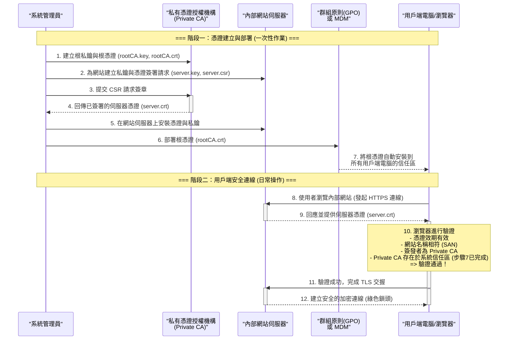

# 內部網路 (Intranet) HTTPS 所需憑證建立流程

為內部網路（Intranet）建立啟用 HTTPS 所需的憑證，這是一個常見且重要的資安實踐。核心概念是：你需要**建立一個自己內部的「憑證授權機構」(Certificate Authority, CA)，並讓內部網路中的所有電腦都信任這個 CA**。

整個流程可以分為以下幾個主要階段，我會詳細說明每個階段的任務和需要注意的「關卡」。

---

### 簡單來說 (TL;DR)

1.  **創造一個「信任的根源」**：建立一個你自己公司的根憑證 (Root CA)。
2.  **分發信任**：把這個根憑證安裝到所有需要連線到內部網站的員工電腦或伺服器上，讓它們「認識」並「信任」這個根源。
3.  **簽發網站憑證**：用你的根憑證，為每一個內部網站 (例如 `portal.my-company.local`) 簽發一個專屬的伺服器憑證。
4.  **部署網站憑證**：將簽發好的伺服器憑證安裝到對應的網站伺服器上 (例如 IIS, Nginx, Kestrel)。

完成後，當員工瀏覽內部網站時，他們的瀏覽器會看到網站憑證是由公司受信任的根憑證簽發的，於是就會顯示安全的綠色鎖頭，而不會跳出「不安全」的警告。

---

### 詳細流程與關卡說明

這裏我們以業界最常用的工具 `OpenSSL` 為例來解說。

#### **階段一：建立你自己的根憑證授權機構 (Root CA)**

這是整個信任鏈的基礎。這個 Root CA 就是你內部網路的最高憑證頒發機構。

*   **流程：**
    1.  **產生 Root CA 的私鑰 (Private Key)**：這是最機密、最重要的檔案，絕對不能外洩。
        ```bash
        openssl genpkey -algorithm RSA -out rootCA.key -aes256 -pkeyopt rsa_keygen_bits:4096
        ```
        *   `aes256` 會要求你設定一組密碼來保護這個私鑰。
    2.  **產生 Root CA 的根憑證 (Root Certificate)**：使用私鑰來簽署一個「自簽憑證」(Self-Signed Certificate)。這個憑證就是你要分發給所有用戶端電腦的檔案。
        ```bash
        openssl req -x509 -new -nodes -key rootCA.key -sha256 -days:3650 -out rootCA.crt
        ```
        *   `-days 3650`：設定效期為 10 年。Root CA 的效期通常很長。
        *   過程中會請你輸入國家、組織、單位等資訊，**「Common Name (CN)」** 最為重要，可以取一個有意義的名稱，例如 `My Company Internal Root CA`。

*   **🚨 關卡與注意事項：**
    *   **私鑰的保管**：`rootCA.key` 是你整個內部網路安全的核心。一旦外洩，駭客就能用它簽發任意的憑證，進行中間人攻擊。**務必將其存放在離線、加密、權限控管嚴格的安全位置。**
    *   **密碼強度**：設定的私鑰保護密碼一定要足夠複雜。

#### **階段二：在所有用戶端電腦上安裝並信任 Root CA 憑證**

這是最關鍵的一步，目的是讓所有內部電腦的作業系統都信任你的 Root CA。

*   **流程：**
    *   你需要將 `rootCA.crt` 這個檔案分發給所有需要連線的使用者。
    *   **Windows**:
        1.  執行 `certlm.msc` (本機電腦) 或 `certmgr.msc` (目前使用者)。
        2.  找到 **「受信任的根憑證授權單位 (Trusted Root Certification Authorities)」** -> 「憑證 (Certificates)」。
        3.  右鍵 -> 「所有工作」 -> 「匯入」，然後選擇你的 `rootCA.crt` 檔案。
    *   **macOS**: 打開「鑰匙圈存取 (Keychain Access)」，將 `rootCA.crt` 拖入「系統 (System)」鑰匙圈，然後在該憑證上點兩下，將信任設定改為「永遠信任 (Always Trust)」。
    *   **Linux (Ubuntu/Debian)**: 將 `rootCA.crt` 複製到 `/usr/local/share/ca-certificates/`，然後執行 `sudo update-ca-certificates`。

*   **🚨 關卡與注意事項：**
    *   **大規模部署**：對於企業環境，手動安裝不切實際。應使用 **群組原則 (GPO)** (Windows) 或 **行動裝置管理 (MDM)** 方案來自動將 Root CA 憑證部署到所有網域內的電腦。
    *   **非瀏覽器應用程式**：記得不只是瀏覽器，其他應用程式如 `curl`、`wget`、Java/Python/Node.js 的 HTTP 客戶端，如果它們不使用作業系統的信任存放區，也可能需要額外設定來信任你的 Root CA。

#### **階段三：為你的伺服器簽發專用憑證**

現在你有了一個受信任的 CA，可以開始為你的內部網站 (例如 `myservice.mycorp.local` 或 `192.168.1.100`) 簽發憑證了。

*   **流程：**
    1.  **為伺服器產生私鑰**：
        ```bash
        openssl genpkey -algorithm RSA -out server.key -pkeyopt rsa_keygen_bits:2048
        ```
    2.  **產生憑證簽署請求 (Certificate Signing Request, CSR)**：
        ```bash
        openssl req -new -key server.key -out server.csr
        ```
        *   在過程中，**「Common Name (CN)」必須是你的伺服器網域名稱**，例如 `portal.my-company.local`。
    3.  **建立 v3.ext 檔案 (非常重要！)**：現代瀏覽器要求主機名稱必須存在於 `Subject Alternative Name (SAN)` 欄位中，只在 CN 裡是不夠的。建立一個名為 `v3.ext` 的檔案，內容如下：
        ```ini
        authorityKeyIdentifier=keyid,issuer
        basicConstraints=CA:FALSE
        keyUsage = digitalSignature, nonRepudiation, keyEncipherment, dataEncipherment
        subjectAltName = @alt_names

        [alt_names]
        DNS.1 = portal.my-company.local
        DNS.2 = another-alias.my-company.local  # 可選的別名
        IP.1 = 192.168.1.50                     # 可選的 IP 位址
        ```
    4.  **使用 Root CA 簽署伺服器 CSR**：
        ```bash
        openssl x509 -req -in server.csr -CA rootCA.crt -CAkey rootCA.key -CAcreateserial -out server.crt -days 398 -sha256 -extfile v3.ext
        ```
        *   `-days 398`：伺服器憑證效期建議短一點（例如一年），方便輪替。
        *   這一步會產生 `server.crt`，這就是你的伺服器憑證。

*   **🚨 關卡與注意事項：**
    *   **SAN (Subject Alternative Name) 是必須的**：如果沒有 `v3.ext` 檔案並在簽署時使用 `-extfile` 參數，Chrome 等瀏覽器會顯示 `NET::ERR_CERT_COMMON_NAME_INVALID` 錯誤，即使 CN 正確也沒用。
    *   **網域名稱/IP 必須匹配**：SAN 中列出的 DNS 名稱和 IP 位址，必須和你實際上用來存取服務的 URL 完全一致。

#### **階段四：在網站伺服器上設定 HTTPS**

最後一步，將 `server.key` (伺服器私鑰) 和 `server.crt` (伺服器憑證) 安裝到你的 Web Server。

*   **流程：**
    *   **Kestrel (.NET)**: 在 `appsettings.json` 或程式碼中設定 Kestrel 的 HTTPS 端點，指向憑證檔案（通常是 `.pfx` 格式）。你可以用 OpenSSL 將 `.crt` 和 `.key` 合併為 `.pfx`：
        ```bash
        openssl pkcs12 -export -out server.pfx -inkey server.key -in server.crt
        ```
    *   **Nginx**: 在 `nginx.conf` 的 `server` 區塊中設定：
        ```nginx
        listen 443 ssl;
        ssl_certificate /path/to/server.crt;
        ssl_certificate_key /path/to/server.key;
        ```
    *   **IIS**: 在伺服器憑證功能中，匯入 `.pfx` 檔案，然後在網站的「繫結 (Bindings)」中新增一個 HTTPS 繫結，並選取該憑證。

*   **🚨 關卡與注意事項：**
    *   **檔案權限**：確保執行 Web Server 的使用者帳戶有權限讀取憑證和私鑰檔案。
    *   **憑證鏈 (Certificate Chain)**：在某些情況下，你可能需要提供完整的憑證鏈（伺服器憑證 + 中繼憑證 + 根憑證）。但在這種簡單的內部 CA 情境下，通常只需要伺服器憑證即可，因為用戶端已經直接信任了根憑證。

---

### 流程總結與關卡速查

| 階段 | 核心任務 | 🚨 最重要的關卡/陷阱 |
| :--- | :--- | :--- |
| **一、建立 Root CA** | 產生 `rootCA.key` 和 `rootCA.crt` | **私鑰 (`.key`) 的絕對安全**，必須離線妥善保管。 |
| **二、部署信任** | 將 `rootCA.crt` 安裝到所有用戶端的「受信任的根...」存放區 | **必須用 GPO/MDM 進行自動化部署**，否則無法管理。 |
| **三、簽發伺服器憑證** | 為每個服務產生 `server.key` 和 `server.crt` | **必須使用 SAN (Subject Alternative Name)**，否則瀏覽器會報錯。 |
| **四、設定伺服器** | 在 Web Server 上設定 HTTPS，指向憑證和私鑰 | **憑證的網域名稱/IP** 必須與使用者存取的 URL 完全一致。 |

---

### 流程時序圖

這時序圖 (Sequence Diagram)，清晰地說明了從憑證建立到用戶端安全連線的整個流程。



### 圖表解說

此時序圖主要分為兩個階段：

1.  **階段一：憑證建立與部署 (一次性作業)**
    *   此階段描述了系統管理員的初始設定工作。
    *   管理員先建立一個可信的根源 (Private CA)。
    *   然後為每個網站服務向這個 CA 申請一個專屬憑證。
    *   最重要的一步是，透過 GPO 或 MDM 等管理工具，將這個「根源」的信任關係，強制部署到組織內的所有電腦上。

2.  **階段二：用戶端安全連線 (日常操作)**
    *   此階段描述了在設定完成後，使用者每天實際發生的連線流程。
    *   當使用者瀏覽內部網站時，網站會出示它的憑證。
    *   使用者的瀏覽器會檢查這個憑證，並發現它是由公司內部那個已經被信任的 Private CA 所簽發的。
    *   因為信任鏈完整，驗證通過，瀏覽器便會顯示安全的連線圖示，整個通訊過程都會被加密。
