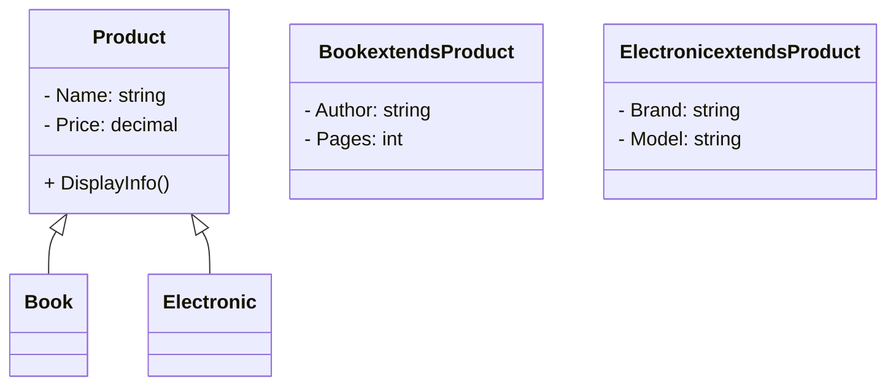

## UML 類別圖

```plantuml
@startuml
class Product {
    - Name: string
    - Price: decimal
    + DisplayInfo()
}

class Book extends Product {
    - Author: string
    - Pages: int
}

class Electronic extends Product {
    - Brand: string
    - Model: string
}

Product <|-- Book
Product <|-- Electronic
@enduml
